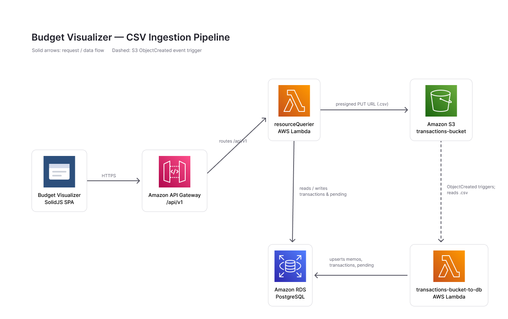
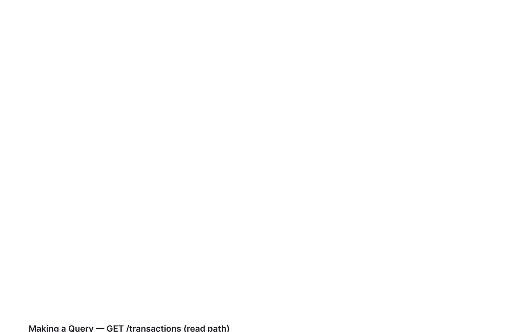

# budget-visualizer-app

A SolidJS client which hits my resourceQuerier.

<p>
  
  &nbsp;&nbsp;
  
  &nbsp;&nbsp;
  
  &nbsp;&nbsp;
  
</p>

## Architecture

The app is the SolidJS client in a small serverless stack: it talks to **resourceQuerier** (a Node Lambda behind API Gateway) for every read and write, while CSV statements are ingested asynchronously by **transactions-bucket-to-db** (a Python Lambda triggered by S3) into a shared PostgreSQL database.

### CSV ingestion pipeline

Uploading a statement issues a presigned S3 `PUT`; the `ObjectCreated` event triggers the ingestion Lambda, which parses, dedupes, and upserts rows into PostgreSQL.



### Making a query (read path)

Reads are user-scoped: API Gateway authorizes the JWT, then resourceQuerier assembles a `WHERE user_id = $1` query before returning JSON — cached client-side by TanStack Query.



> Diagrams are maintained in [Figma](https://www.figma.com/design/XFuOT2EyY24FZTBZHk4EU0).

## Usage

This project uses **[Bun](https://bun.sh)** to install dependencies, run the dev server, and build locally.

```bash
bun install
```

### Learn more on the [Solid Website](https://solidjs.com) and come chat with us on our [Discord](https://discord.com/invite/solidjs)

## Available Scripts

In the project directory, you can run:

### `bun run dev`

Runs the app in development mode.<br>
Open [http://localhost:5173](http://localhost:5173) in the browser (see `vite.config.ts` if the port differs).

### `bun run build`

Type-checks and builds the app for production into the `dist` folder.<br>
Solid is bundled in production mode with hashed filenames.

### `bun run preview`

Serves the production build locally (useful for checking the built app before deploy).

## Testing

Unit and component tests use **Vitest** + **jsdom** + **@solidjs/testing-library**:

```bash
bun run test        # single run
bun run test:watch  # watch mode
```

End-to-end tests live under **`tests/e2e/`** and use **Playwright** against a production preview (`vite preview` on port 4173). Unit and component tests live under **`tests/unit/`**. The first Playwright run needs browsers installed once:

```bash
bunx playwright install chromium
bun run test:e2e
```

E2E tests stub `/api/v1/*` in the browser and seed `localStorage` so authenticated routes load without a real API. Run everything:

```bash
bun run test:all
```

## Deployment

Produce a deployable bundle with `bun run build` (output in `dist/`). Learn more in the Vite [static deploy guide](https://vite.dev/guide/static-deploy.html).
